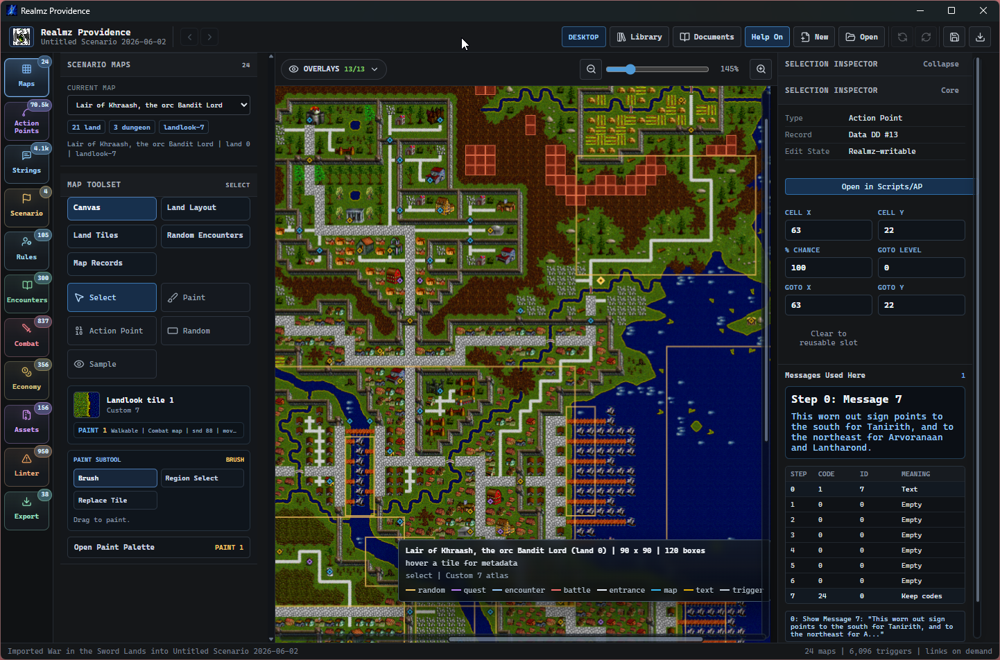
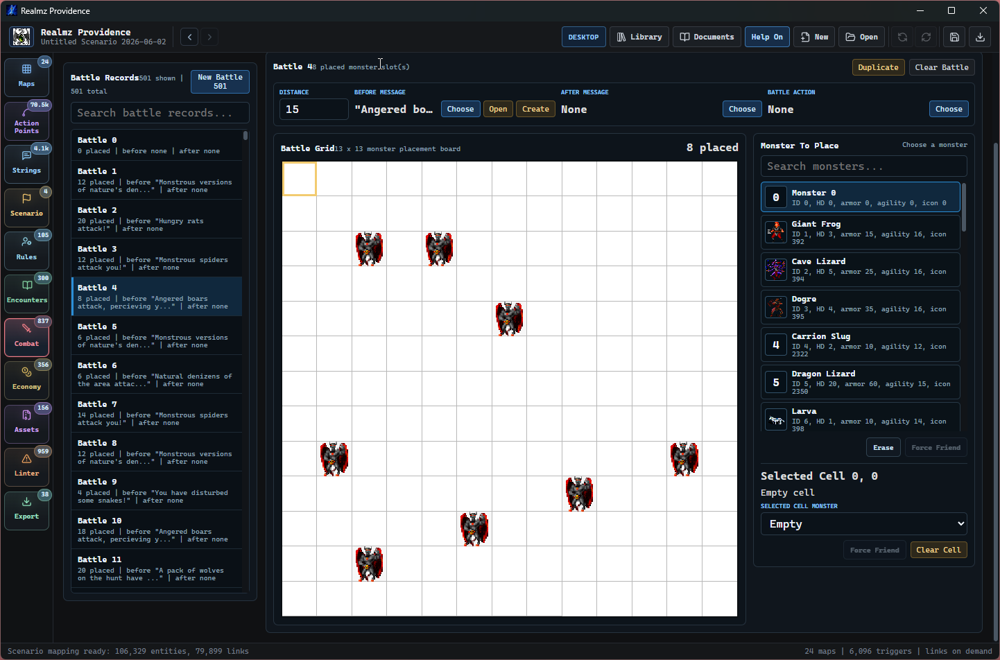
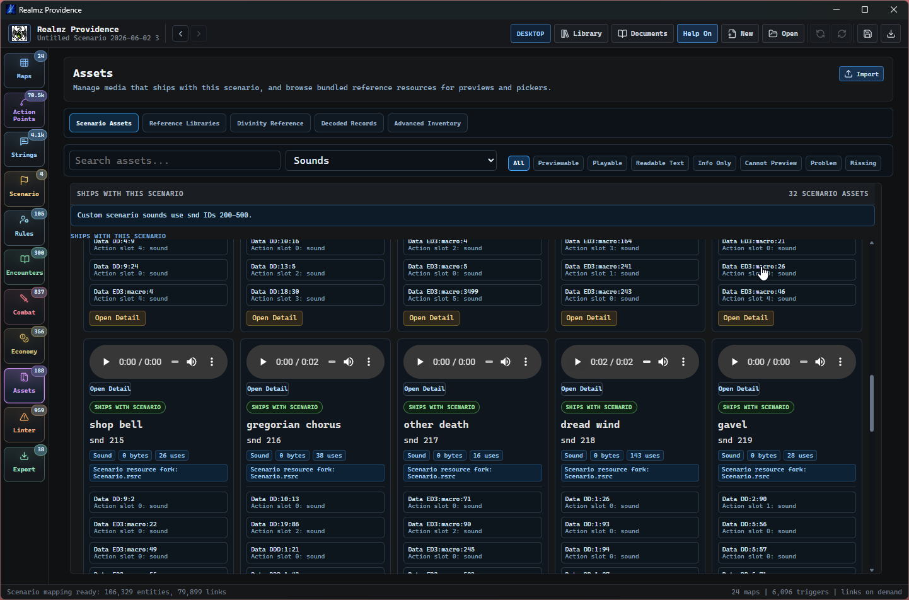

# Realmz Providence

Providence is a modern scenario editor for Realmz. The current release is 0.3.2.

It is trying to do two things at once:

- make Realmz scenario authoring feel usable on a modern machine
- preserve old scenario data carefully enough that import/export does not quietly damage anything

That second part matters. Realmz scenarios contain a lot of classic Mac-era binary data, resource forks, packed records, and runtime quirks. Providence treats the original files as evidence, keeps unknown data visible or preserved, and only writes the parts we understand well enough to edit safely.

The app is built with React/Vite on the frontend and Tauri/Rust on the desktop side.

## 0.3.2 Packaging Update

The 0.3.2 release makes the smaller online Windows installer the primary download while retaining a separately named offline installer.

- The standard Windows setup downloads Microsoft's Evergreen WebView2 bootstrapper only when the runtime is missing.
- Windows 10 and 11 systems that already have WebView2 install Providence without downloading another runtime copy.
- The offline setup continues to bundle the complete WebView2 installer for disconnected or archival use.
- Release builds now produce and verify both Windows variants so an offline build cannot accidentally replace the primary online artifact.

## 0.3.1 Update

The 0.3.1 update hardens generated scenario maps and makes Complex Encounter responses faster to author and inspect.

- **Generated map composition** now supports organic terrain regions, coherent forests and mountain borders, sparse landlook-aware decoration, safer roads, and better placement of structures, ships, caves, and their Action Points.
- **Portal and Action Point placement** keeps door and cave teleports on their actual entrance tiles, places nearby points of interest more deliberately, and makes map Selection Inspector steps immediately navigable without first opening the Scripts tool.
- **Runtime landlooks** are now written into generated browser scenario packages, preventing Castle and other non-Plains levels from appearing with corrupted Plains tiles in Realmz.
- **Castle generation** uses solid outer fill, reviewed wall-facing transitions, corner pieces, and correctly oriented doors.
- **Complex Encounter responses** use compact inline item choices, fixed-width action controls, and floating searchable pickers for spell, scroll, item, string, battle, treasure, shop, and other referenced result targets.
- **Response previews** show the selected record in place instead of navigating away, while Magic and Item pickers search their complete catalogs by name, category, details, or ID.
- **Compatibility display** recognizes Realmz's blank Magic Response sentinel as an empty spell/scroll selection while preserving its stored value.

## 0.3.0 Highlights

The 0.3.0 release adds a prompt-safe scenario creation contract and turns the map editor's accumulated Realmz terrain knowledge into practical semantic authoring tools.

- **Scenario JSON generation** can now create validated Providence projects from a compact prompt-oriented schema instead of requiring callers to construct internal project JSON. Generated projects attach a Realmz runtime baseline and export through both Windows and Mac browser package paths.
- **Action Point generation** covers the complete documented opcode range, negative carry-through values, prompt-safe semantic aliases, settings-backed actions, runtime branch targets, timed events, encounters, items, conditions, and keyed cross-record references.
- **Generated scenario content** now includes messages, maps, Action Points, simple and complex encounters, battles, treasures, shops, monsters, items, rules, custom assets, named regions, and deterministic ID allocation reports for repair loops.
- **Semantic map operations** add stable named tiles, reusable named stamps, semantic roads, water, mountains, forests, secret areas, hidden-walkable terrain, combat-clearing terrain, and directional dungeon passages without requiring prompts to know raw Realmz tile IDs.
- **Audited terrain knowledge** now documents the functional and visual roles of Plains, Subterranean, Castle, Desert, Swamp, and Snow tiles, including cave transitions, structures, props, hidden paths, combat-clearing structures, and Castle architectural pieces.
- **Smart Brushes** now use reviewed directional rules before corpus or pixel fallback. Narrow streams select exact ends, straights, bends, and forks; new terrain joins compatible existing terrain; shoreline variants are resolved together so shared edges meet and oversized triangular spikes are avoided.
- **Map palettes and overlays** distinguish hidden-walkable terrain from combat-clearing terrain, scope those behaviors by landlook, provide landlook-specific authoring categories, merge duplicate advanced tile sources, and expose an all-tiles palette.
- **Generation smoke coverage** compiles representative scenarios across eight feature lanes and validates 16 Windows/Mac browser package exports, with focused regression coverage for semantic terrain topology and loaded-atlas Smart Brush behavior.

## 0.2.1 Hotfix

The 0.2.1 hotfix corrects Combat monster library, imported scenario monster display, and Caste reference display regressions found after the 0.2.0 release.

- Desktop now refreshes stale bundled Divinity Monster Scrap Book catalogs that were previously decoded as 210-byte monster records instead of 466-byte scrapbook entries.
- Combat hides unreferenced imported monster tail records after the Realmz bestiary terminator while preserving and exporting their source bytes.
- Battle-referenced or newly authored post-terminator monster records still appear where they matter, and validation no longer reports noise for preserved imported tail data.
- Rules now treats blank imported `Data Caste` rows as placeholders instead of scenario-authored overrides, so standard castes fall back to Realmz reference stats and CICN default icons until the author creates a real scenario caste override.

## 0.2.0 Highlights

The 0.2.0 release is a large authoring pass. It adds a real in-app authoring manual, broadens the safe editing surfaces, and makes import/export behavior easier to understand before a scenario leaves Providence.

- The new **Providence Authoring Manual** replaces the older source-first document set with 13 author-facing chapters and appendices for compatibility, Divinity references, libraries, technical evidence, coverage, and troubleshooting.
- **Player Maps** are now an authoring surface, including classic-scale previews, marker editing, and better coordination with the main map tools.
- **Maps** gained custom landlook authoring, clearer stamp/palette behavior, denser sidebar organization, and safer Action Point synchronization when map records move.
- **Action Points and scripts** received a substantial authoring cleanup: better opcode naming, paired chooser aliases, draft-change guards, visible-result warnings, contextual command links, and more direct controls for target and item fields.
- **Strings and styled text** now support imported TEXT and styl resources, directly editable scrolling text previews, Classic TextEdit-style alignment previews, and preserved routing between text workflows and assets.
- **Combat, monsters, and economy** gained stronger authoring flows, including a reusable Providence monster library, monster set editing, battle grid performance work, treasure reward icons, and improved shop/item presentation.
- **Assets** are now split into Scenario Assets, a workspace-scoped Custom Library, Reference Assets, and lower-priority technical inventory views. Scenario asset imports cover images, icons, sounds, text, styled text, and raw resources, with safer scenario ID allocation and stock-asset guards when copying from libraries.
- **Browser and export workflows** now support project persistence, browser raw-source packages, browser scenario package export, battle and monster scenario writers, clearer export readiness panels, and more precise source-preservation diagnostics.
- Validation and smoke tooling was expanded around desktop asset performance, primary editor workflows, map painting, text assets, package export, Action Point coverage, and release gates.

## Screenshots

Providence is built around direct scenario authoring: open a map, inspect the original records, edit the parts that are understood, and keep the rest preserved.



The editor also includes focused tools for combat, economy, strings, encounters, rules, scenario metadata, and assets.



Scenario resources can be inspected and previewed, including custom pictures, icons, sounds, text resources, and other classic Realmz resource-fork data.



## Getting Started

Launch the desktop app, then click **New** to create a Providence project. A project is where Providence keeps the imported scenario files, decoded records, generated previews, and editor metadata.

After creating a project, import a Realmz scenario folder if you already have one. Pick the folder that contains the scenario data files and resource files, and Providence will seed the project from those originals.

You can also start from scratch in a new project. Use the Maps, Player Maps, Action Points, Strings, Scenario, Encounters, Combat, Economy, Rules, and Assets tools to build up the scenario piece by piece. When you are ready, use Export to write a conservative Realmz/Revisited-style scenario package.

The Documents button opens the Providence Authoring Manual. It is written around authoring tasks first, with the Divinity manual and local evidence available as supporting references when you need to understand legacy behavior.

## What Works

Providence can currently:

- create and open `.providence` project packages
- import Realmz scenario folders
- browse and edit maps and Player Maps
- paint land/dungeon tiles and special land/icon-backed tiles with semantic terrain brushes, named tiles, and reusable stamps
- author hidden/revealed Secret Areas, hidden-walkable terrain, combat-clearing terrain, and directional dungeon passages
- author custom landlooks and reusable map stamps
- generate validated, exportable Providence projects from the prompt-safe Scenario JSON schema
- edit Action Points and reusable action data
- edit scenario strings, option labels, TEXT resources, and styled scrolling text
- inspect and edit encounters, battles, monsters, economy records, rules, and scenario metadata
- build combat encounters with battle, monster, monster-art, and treasure-library workflows
- import, preview, preserve, replace, and deep-link scenario assets
- keep reusable non-stock assets in the workspace Custom Library until they should become scenario-bundled assets
- use Reference Assets for useful stock/classic material without making provenance the primary authoring model
- package projects and scenarios from the browser workflow when the host browser supports the required file APIs
- preserve data that is not safely authorable yet
- export conservative Realmz/Revisited-style scenario packages

Some surfaces are still more editor than others. A few are still closer to decoded/inspectable records than comfortable authoring tools. That is expected for now, and unsupported source files are preserved unless Providence has a proven writer for that data.

## Desktop Vs Browser

There are two ways to run Providence during development.

The **desktop app** is the real target. It uses Tauri commands for filesystem access, project storage, import/export, bundled libraries, and native packaging.

The **browser version** is useful for quick development and Browser FS experiments. It can import through the browser File System Access API where supported, but it is not the primary shipping workflow.

Heavy semantic mapping is intentionally not part of the normal map/string startup path. The editor should load the scenario first, then build richer links only when an advanced or link-heavy tool actually needs them.

## Setup

Install dependencies:

```powershell
npm install
```

Run the web dev server:

```powershell
npm run dev
```

Run the desktop app:

```powershell
npm run desktop
```

Build the frontend:

```powershell
npm run build
```

Build the desktop app:

```powershell
npm run dist
```

Run the Windows-focused release gate:

```powershell
npm run release:desktop-gate:windows
```

## Checks

Useful checks while working:

```powershell
npm run typecheck
npm run check:architecture
npm run smoke:scenario-generation
npm run test:rust
npm run check
```

`npm run check:architecture` checks feature ownership, compiler/storage direction, and the stable mutation/generation/codec facades. `npm run smoke:scenario-generation` compiles representative Scenario JSON fixtures, validates the generated Providence projects, attaches the generated Realmz runtime baseline, and exports both Windows and Mac browser packages. `npm run check` is the broad pass: refactor guardrails, TypeScript, Action Point coverage, frontend build, and Rust tests. The release gate scripts add packaging-oriented checks and optional editor smokes.

There are also smoke and archaeology scripts under `scripts/`. Many of those assume the local Realmz/Providence development environment and are mostly for deeper validation work.

## Where Projects Live

The desktop app stores its own app data under the platform app-data directory. On Windows, that is usually somewhere like:

```text
%LOCALAPPDATA%\local.realmz.providence\
```

Projects normally live under `projects/` inside that app-data folder, unless you open a project package from somewhere else.

A `.providence` project is a folder. It contains `project.json`, preserved raw sources, generated assets, scenario-bundled assets, and editor metadata. The workspace Custom Library is separate from an individual scenario so useful Providence-created assets can be reused across scenarios. Derived semantic/archaeology data is not the source of truth and should not be treated like project content.

## Development Notes

A few principles have saved pain:

- The scenario files and parsed records are the source of truth.
- Derived archaeology should stay derived.
- Normal authoring tools should open quickly.
- Big link graphs should be lazy or tool-specific.
- Large lists should be capped, indexed, or virtualized instead of rendered all at once.
- Unknown bytes should be preserved unless we have evidence that they are safe to write.

When searching the repo, `rg` is your friend.

The authoritative module ownership, dependency, generated-source, and no-behavior-change rules are in [`docs/codebase-stabilization-baseline.md`](docs/codebase-stabilization-baseline.md). Update that document instead of creating a competing architecture guide.

## Archaeology

Providence includes scripts for byte coverage, round-trip checks, resource coverage, and target compatibility. Examples:

```powershell
npm run archaeology:roundtrip-audit
npm run archaeology:byte-coverage
npm run archaeology:resource-coverage
npm run archaeology:target-compatibility
```

Generated reports live in `docs/generated/`.

The goal of archaeology work is not trivia. It should unlock authoring, validation, export safety, or a clearer explanation for the user.

## Repo Layout

```text
src/                 React/Vite frontend
src/editor/          Editor panels, workbench shell, browser-mode importers
src-tauri/           Tauri desktop backend and Rust scenario parsers
scripts/             Smoke tests, archaeology generators, release helpers
docs/                Project notes and generated evidence
public/              Static browser assets
```

## Status

Providence is pre-1.0. It is already useful, but it is still an active archaeology and editor-design project.

The safest mental model is: edit what Providence clearly supports, preserve everything else, and let export stay conservative.
