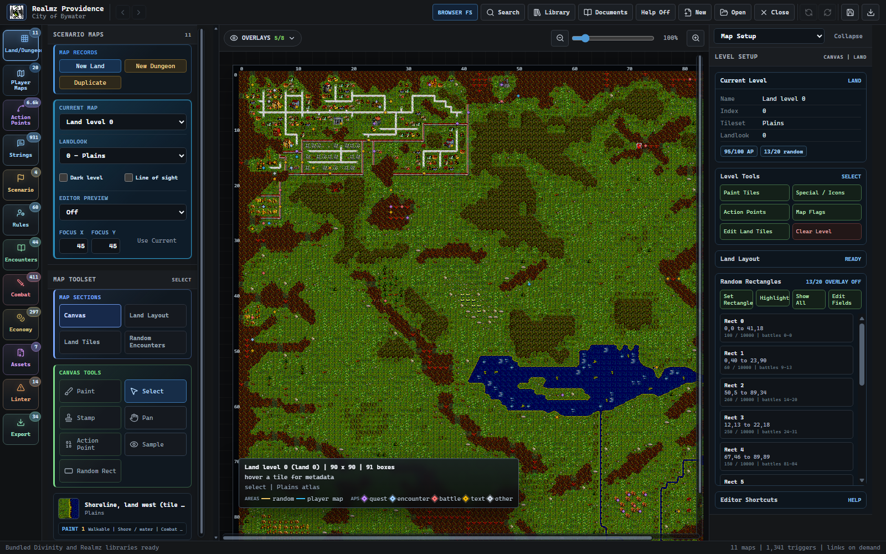
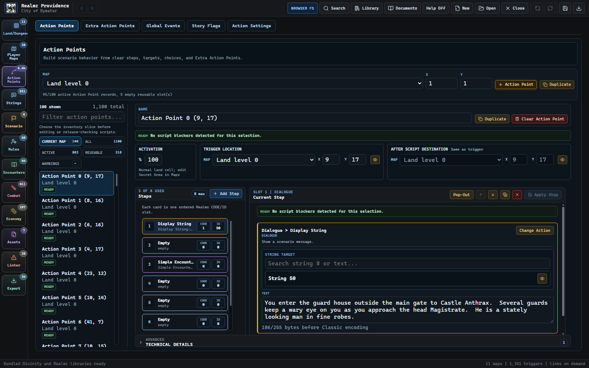
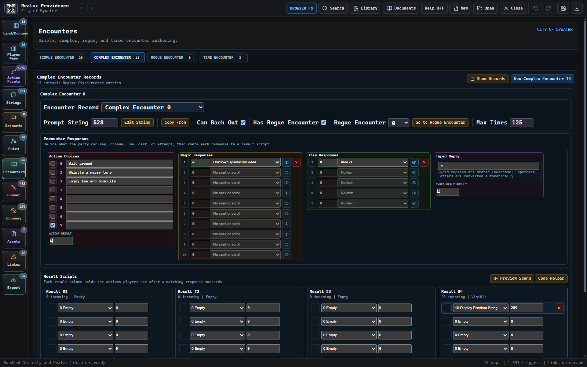
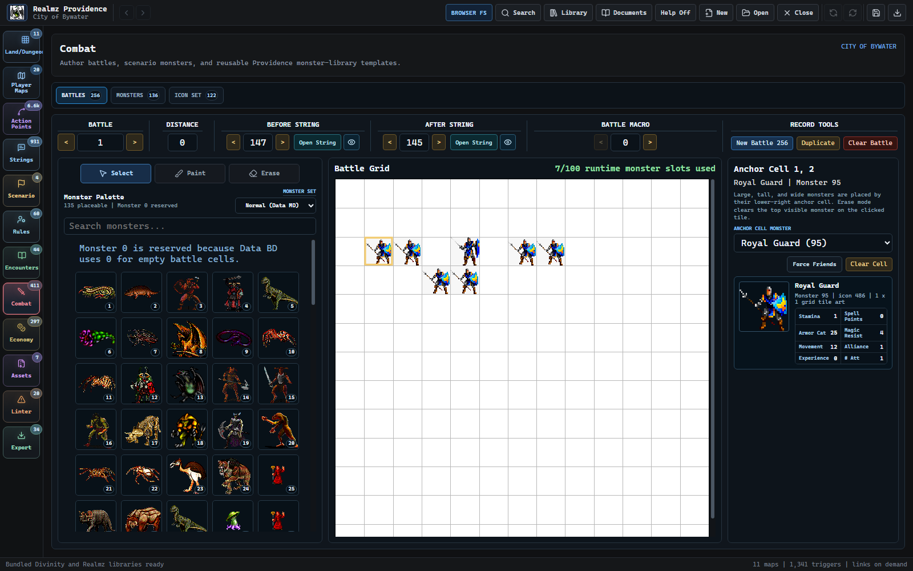
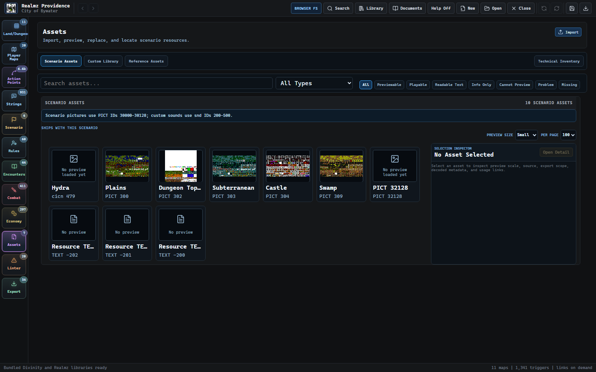
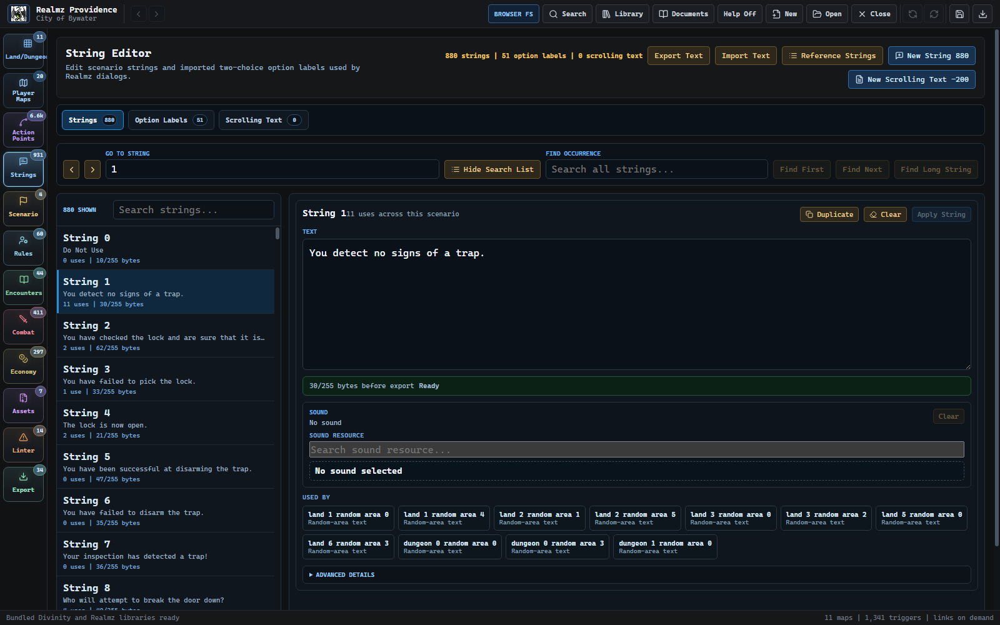
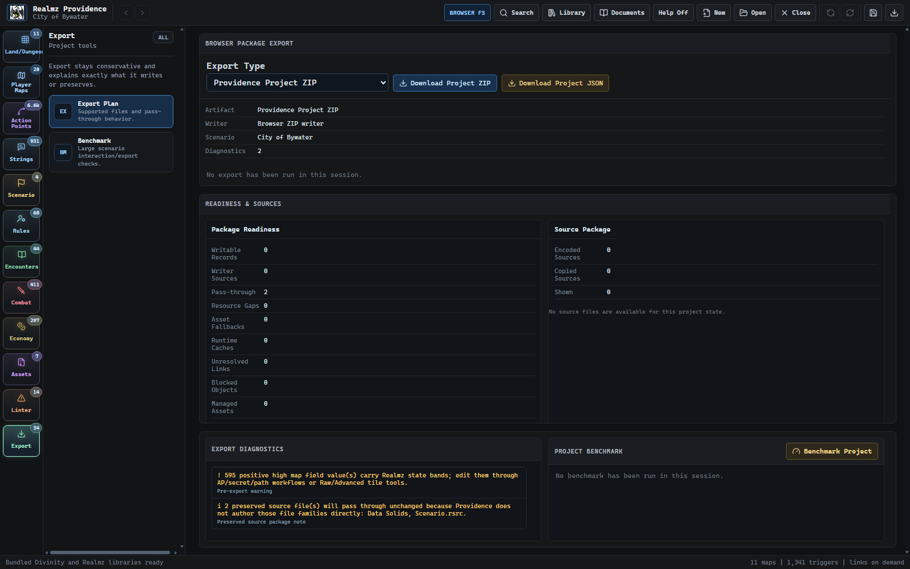

# Realmz Providence

**A modern scenario editor and creator for Realmz.**

[Download the latest release](https://github.com/iSynic/Realmz-Providence/releases/latest) | [Release history](https://github.com/iSynic/Realmz-Providence/releases) | [MIT License](LICENSE)



Providence turns Realmz scenario data into a connected set of visual authoring tools. Maps, Action Points, encounters, combat, rules, text, assets, validation, and export all live in one project instead of being spread across low-level record editors.

It is designed for two kinds of work:

- creating new Realmz scenarios with modern, searchable authoring tools
- importing existing scenarios, editing them safely, and exporting packages that Realmz can use

Providence is not a clone of Divinity's interface. It presents the same game concepts around the author's intent: paint a road, choose a monster, preview a string, connect a door, or inspect a warning without first translating everything into raw file and record terminology.

## Download

The current release is **Realmz Providence 0.3.4**.

| Platform | Package |
| --- | --- |
| Windows x64 | Standard online setup, offline setup, or MSI |
| Linux x64 | AppImage, Debian package, or RPM |

The standard Windows setup is the primary installer. It downloads Microsoft WebView2 only when the runtime is not already installed. The separately named offline setup bundles WebView2 for disconnected systems.

All installers are available on the [latest release page](https://github.com/iSynic/Realmz-Providence/releases/latest). The desktop application is the primary Providence experience; the browser build is also useful for development and browser-based project/package workflows.

## Why Providence

- **Author in game concepts.** Action Point steps, encounter responses, monsters, treasure, map locations, and assets are labeled and edited by purpose instead of exposed only as CODE/ID pairs.
- **See relationships before following them.** Search pickers, inline previews, usage links, and map markers keep referenced strings, battles, scripts, items, sounds, and destinations close to the field being edited.
- **Build maps visually.** Landlook-aware palettes, named tiles and stamps, semantic roads, smart terrain, overlays, and direct Action Point placement make maps practical to create and revise.
- **Work across the whole scenario.** Scenario setup, maps, scripts, encounters, combat, economy, rules, assets, text, diagnostics, and export share one normalized project model.
- **Catch problems before Realmz does.** The linter reports broken references, missing resources, invalid ranges, script problems, export risks, and compatibility concerns with links back to the owning tool.
- **Preserve what you did not edit.** Imported classic Mac data and unsupported source material remain available to the export pipeline instead of being silently discarded.

## Authoring Tour

### Action Points and encounters

Action Points are shown as ordered, named steps with focused controls for their actual parameters. Complex Encounters bring response conditions, item and magic choices, result scripts, and searchable target previews into one workbench.

<table>
  <tr>
    <td width="50%"></td>
    <td width="50%"></td>
  </tr>
  <tr>
    <td><strong>Action Points</strong><br>Choose actions by purpose, edit their settings, inspect destinations, and move between scripts and map locations.</td>
    <td><strong>Complex Encounters</strong><br>Author visible responses, requirements, sounds, items, magic choices, and the scripts that run after each result.</td>
  </tr>
</table>

### Combat and reusable assets

Combat combines battle layout, scenario monsters, the reusable monster library, and monster previews. Assets are separated by how authors use them: bundled Scenario Assets, the reusable Custom Library, and stock Reference Assets.

<table>
  <tr>
    <td width="50%"></td>
    <td width="50%"></td>
  </tr>
  <tr>
    <td><strong>Combat</strong><br>Build battle grids, browse monsters with their icons and statistics, and keep scenario-specific records separate from reusable library entries.</td>
    <td><strong>Assets</strong><br>Import and preview pictures, icons, sounds, text, styled text, and raw resources, then copy only the material a scenario must bundle.</td>
  </tr>
</table>

### Text and release readiness

Strings are searchable, editable, byte-aware, and linked to their uses throughout the scenario. Export gathers validation, target-package choices, source preservation, and generated files into a final readiness pass.

<table>
  <tr>
    <td width="50%"></td>
    <td width="50%"></td>
  </tr>
  <tr>
    <td><strong>Strings and Text</strong><br>Edit scenario messages and scrolling text, inspect byte limits and style resources, assign sounds, and follow usage links.</td>
    <td><strong>Lint and Export</strong><br>Review actionable warnings, package contents, compatibility notes, and export targets before producing a Realmz scenario.</td>
  </tr>
</table>

## What You Can Author

### Maps and navigation

- Land and dungeon levels with standard, custom, and special tiles
- Landlook-specific palettes, larger semantic categories, stamps, and smart brushes
- Roads, water, shorelines, mountains, forests, walls, doors, caves, and decorative terrain
- Secret areas, hidden-walkable terrain, combat-clearing terrain, movement, and line-of-sight overlays
- Player Maps, markers, map names, random rectangles, notes, and map-linked Action Points

### Scripts and narrative

- Action Points, Extra Action Points, ordered script steps, branches, destinations, and settings-backed actions
- The complete documented Realmz opcode range, including negative carry-through values
- Scenario strings, string sounds, TEXT resources, styl resources, and scrolling text
- Simple Encounters, Complex Encounters, rogue encounters, timed encounters, quests, and global macros
- Searchable previews for strings, battles, treasures, shops, items, spells, and other referenced records

### Combat, economy, and rules

- Battle maps, deployment grids, battle messages, and scenario monster selection
- Scenario monsters plus a reusable Providence monster and monster-art library
- Items, treasure tables, shops, rewards, and item families
- Spells, races, castes, scenario overrides, startup restrictions, and scenario registration data

### Assets and references

- Scenario pictures, CICN icons, sounds, TEXT, STR#, styl, special land tiles, and preserved raw resources
- A global Custom Library for reusable Providence material that is not yet tied to a scenario
- Reference Assets for Realmz-owned material that can be used by stock ID
- Safe scenario ID allocation when a library asset must become scenario-owned

### Scenario generation

Providence also includes a prompt-oriented Scenario JSON contract for generating complete project drafts without requiring a caller to construct the internal project model directly. The generation schema supports maps, semantic terrain, named tile placement, reusable stamps, Action Points, encounters, battles, treasure, shops, monsters, items, rules, assets, and deterministic ID allocation reports.

Generated projects use the same validation and export paths as projects authored in the UI. Generation is a starting point, not a substitute for reviewing maps, scripts, balance, and compatibility in Providence.

## Project Workflow

1. **Create or open a project.** Start fresh, open a `.providence.zip` package or `project.json`, or import an existing Realmz scenario folder.
2. **Establish the scenario shell.** Set the title, startup behavior, restrictions, registration details, and target compatibility.
3. **Build the world.** Author land and dungeon levels, Player Maps, routes, structures, terrain, and points of interest.
4. **Connect behavior.** Place Action Points and build their scripts, encounters, battles, treasure, shops, and narrative text.
5. **Add rules and media.** Customize monsters, items, spells, races, castes, icons, pictures, sounds, and other scenario-owned resources.
6. **Lint the project.** Follow warnings to their owning editor and resolve missing references, invalid IDs, script gaps, and export blockers.
7. **Export and test in Realmz.** Produce a Windows or classic Mac scenario package, then test the actual gameplay paths that matter to the scenario.

The in-app **Documents** workbench contains the full Providence Authoring Manual. Its chapters explain each editor, the records it owns, practical workflows, validation behavior, and relevant compatibility details.

## Project Packages

A Providence project keeps structured authoring state and the material needed to build a Realmz scenario together. The main project document is `project.json`; desktop projects use a `.providence` project directory, and `.providence.zip` is the portable package format.

Imported raw sources remain part of the project so Providence can preserve source material that has not been replaced by an authored writer. Scenario Assets travel with the project and export when required. The Custom Library is a separate, growing Providence collection whose entries can be copied into any scenario.

Keep project packages and exported Realmz scenarios under normal backup or version-control practices. Providence is still a pre-1.0 application, and exported scenarios should be tested in the Realmz runtime before release.

## Compatibility Approach

Realmz scenarios combine fixed binary records, classic Mac resource data, packed map structures, generated runtime files, and behavior that is sometimes defined by the game rather than Divinity's interface. Providence handles those layers conservatively without making them the center of the authoring experience.

- Fields with supported writers are editable through normalized Providence tools.
- Unsupported or intentionally untouched source files pass through unchanged.
- Stock Realmz resources remain references when the runtime can resolve them by ID.
- Custom resources are bundled only when the scenario needs to own them.
- Validation distinguishes actionable authoring problems from preserved or informational material.
- Fixture, round-trip, browser/desktop parity, and generated-scenario checks guard known export behavior.

## Build From Source

Providence uses React, TypeScript, and Vite for the editor, with Tauri and Rust for desktop integration and Realmz file handling.

Prerequisites:

- Node.js and npm
- The stable Rust toolchain
- Platform prerequisites required by [Tauri 2](https://v2.tauri.app/start/prerequisites/)

Install dependencies and start the browser development build:

```powershell
npm ci
npm run dev
```

The development server runs at `http://127.0.0.1:5178/`.

Start the native desktop application:

```powershell
npm run desktop
```

Build the frontend or the complete desktop distribution:

```powershell
npm run build
npm run dist
```

## Verification

The full repository gate covers architecture boundaries, linting, unit tests, TypeScript, Action Point coverage, resource and terrain contracts, scenario generation, browser packages, the production build, and Rust tests:

```powershell
npm run check
```

Useful focused commands include:

```powershell
npm run typecheck
npm run lint
npm run test:unit
npm run check:architecture
npm run check:browser-project-package
npm run check:browser-scenario-package
npm run smoke:scenario-generation
npm run test:rust
```

The committed manual gallery can be refreshed against a selected project with `npm run docs:capture-gallery -- --project <path>`.

## Repository Layout

| Path | Purpose |
| --- | --- |
| `src/editor/` | React authoring workbenches, project commands, validation, and browser workflows |
| `src-tauri/src/` | Tauri commands, Realmz codecs, import/export, project storage, and desktop integration |
| `public/manual/gallery/` | Current screenshots used by the manual and README |
| `docs/` | Compatibility evidence, format notes, generated audits, and release procedures |
| `scripts/` | Contract checks, smoke suites, fixture reports, gallery capture, and release automation |

## Status and Contributing

Providence is under active development. Version 0.3.4 supports substantial end-to-end scenario authoring and export, but a real Realmz scenario remains the final compatibility test. Bug reports should include the source scenario or a minimal project package, the owning editor, the affected record or coordinates, the expected Realmz behavior, and whether the problem occurs in the browser, desktop app, exported scenario, or game runtime.

Before submitting code, keep changes scoped, run the relevant focused checks, and use `npm run check` when the affected surface crosses project, export, or shared-record boundaries. Refactors should also follow the [Codebase Stabilization Baseline](docs/codebase-stabilization-baseline.md), which defines the repository's ownership and no-behavior-change constraints.

Realmz Providence is released under the [MIT License](LICENSE).
