# Realmz Providence

**A native scenario authoring toolkit for Realmz.**

[Download the beta](https://github.com/iSynic/Realmz-Providence/releases/tag/v0.6.0-beta.1) · [All releases](https://github.com/iSynic/Realmz-Providence/releases) · [Build from source](docs/public/building.md) · [Licensing](SOURCE-LICENSE.md)

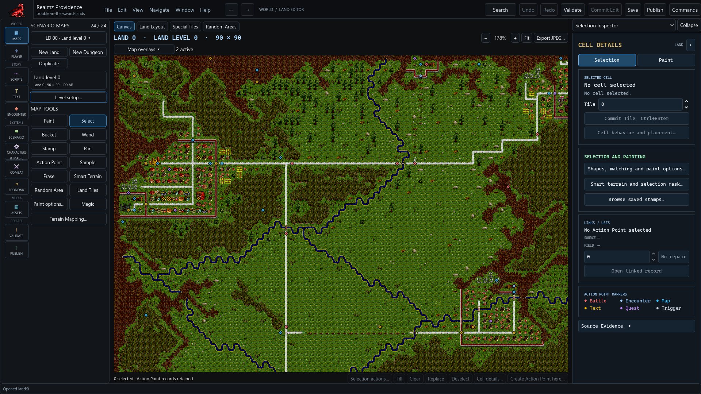

Providence brings Realmz scenario creation to a native desktop editor built with
Godot and Rust. Create a new scenario or import a Classic folder, edit its maps,
scripts, encounters and media, then publish a Classic scenario or a compiled
Realmz Rebuilt package.

The original React/Tauri editor is preserved on
[`legacy/tauri`](https://github.com/iSynic/Realmz-Providence/tree/legacy/tauri), with
[v0.5.9](https://github.com/iSynic/Realmz-Providence/releases/tag/v0.5.9) as its final
web release. `main` now contains the native editor.

## Download

| Platform | Beta package |
| --- | --- |
| Windows x64 | [ZIP](https://github.com/iSynic/Realmz-Providence/releases/download/v0.6.0-beta.1/Providence-v0.6.0-beta.1-windows-x64.zip) |
| macOS, Intel and Apple Silicon | [Universal app ZIP](https://github.com/iSynic/Realmz-Providence/releases/download/v0.6.0-beta.1/Providence-v0.6.0-beta.1-macos-universal.zip) |
| Linux x64 | [tar.gz](https://github.com/iSynic/Realmz-Providence/releases/download/v0.6.0-beta.1/Providence-v0.6.0-beta.1-linux-x64.tar.gz) |

Extract the complete archive and launch **Providence**. Keep the included native
tools and support directories alongside the application. The macOS beta is
signed ad hoc and is not notarized. If macOS blocks its first launch, use Finder's
**Open** command and the system's application approval controls.

The Compatibility renderer requires OpenGL 3.3. Linux builds target x64 systems
with glibc 2.35 or newer. A Rebuilt installation is optional for authoring and
export; interactive playtest uses a separate compatible Rebuilt process.

## Why Providence?

- **Native desktop tools.** Compact workbenches, keyboard shortcuts, command
  palette, contextual inspectors and direct navigation between linked records.
- **Map creation.** Land and Dungeon painting, smart terrain, directional roads
  and walls, special artwork stamps, random areas and player maps.
- **Connected authoring.** Action Points and encounters link to messages,
  battles, monsters, quests and rewards, with exact callers available through
  Used By and Find Uses.
- **Legacy preservation.** Imported scenarios retain source bytes and unrelated
  resource data. Suspicious inherited values stay visible without automatic
  reinterpretation.
- **Useful validation.** Actionable findings are the default; Show all findings
  exposes preservation details. Publish checks the selected export target.
- **Shared compatibility core.** The Rust toolkit owns authored state and
  compilation, keeping UI presentation separate from scenario semantics.

## Authoring tour

These screenshots show the native editor with a freshly imported **Trouble in
the Sword Lands** scenario and the bundled stock reference library.

<table>
<tr><td width="50%"><strong>Action Points</strong> 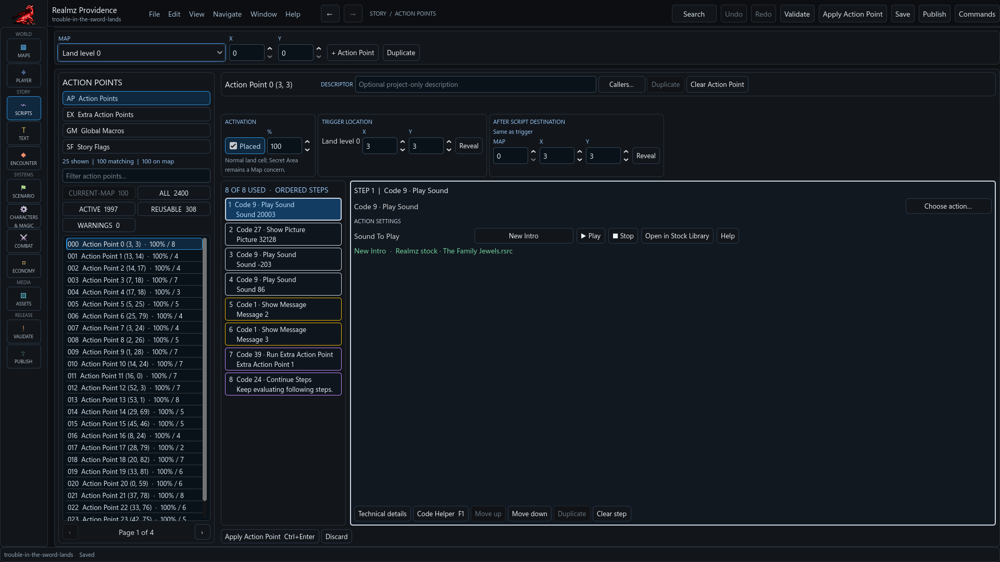 Ordered script steps, trigger placement, result destinations and callers.</td><td width="50%"><strong>Complex Encounters</strong> 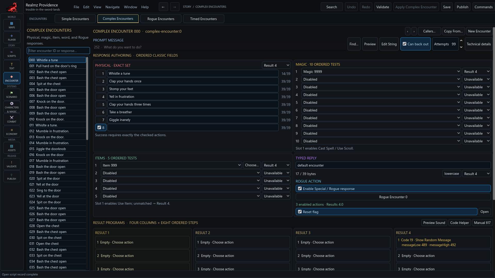 Prompts, choices, conditions, spells and result scripts.</td></tr>
<tr><td><strong>Monsters</strong> 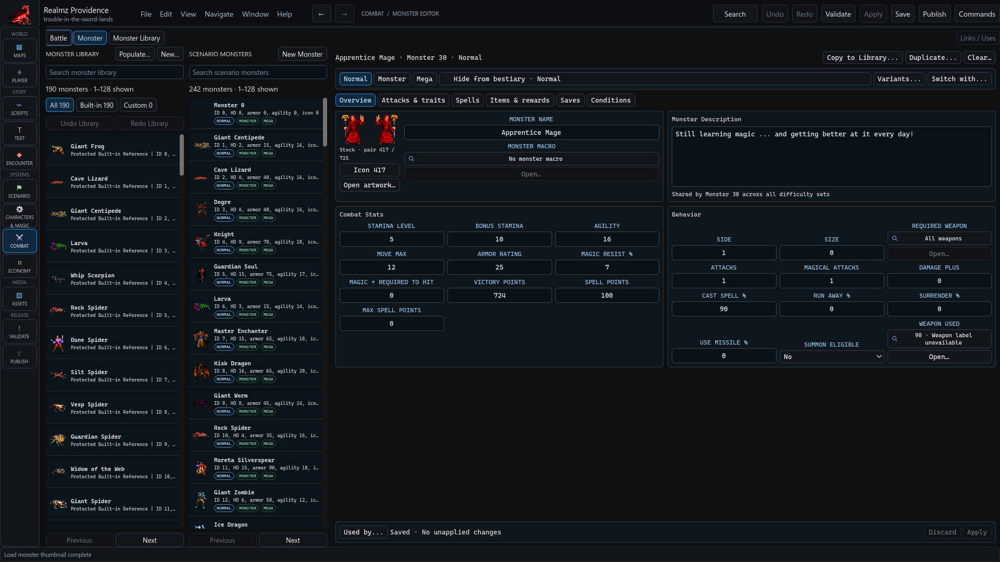 Scenario monsters, stock and personal libraries, difficulty sets and linked records.</td><td><strong>Battles</strong> 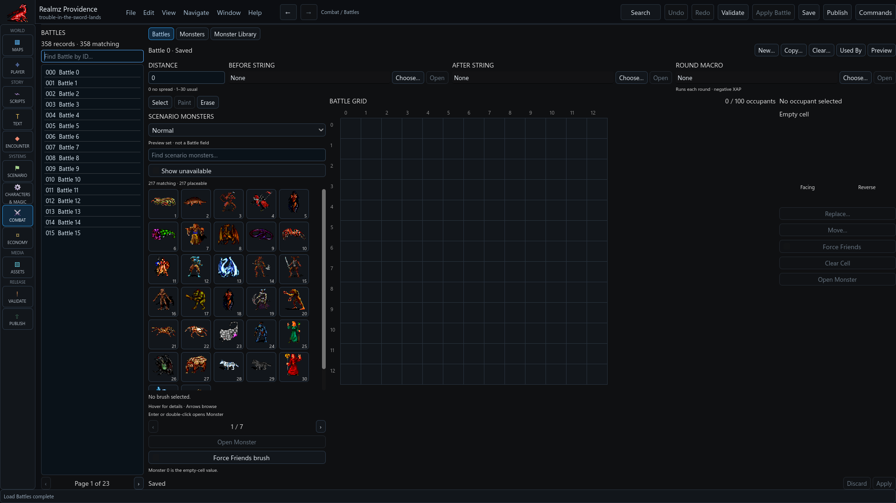 Combat layout, monster placement and battle settings.</td></tr>
<tr><td><strong>Strings</strong> 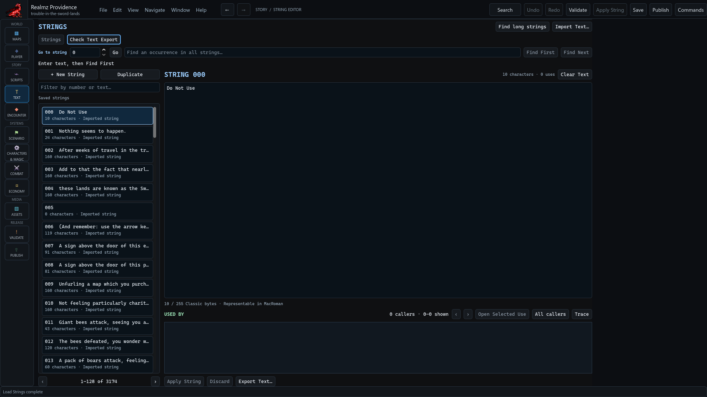 Messages, search, export checks and exact uses.</td><td><strong>Assets</strong> 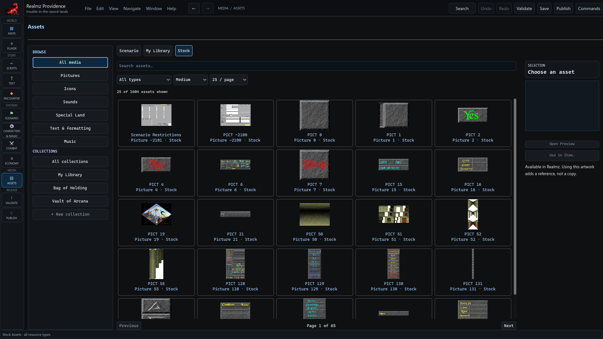 Scenario and reference media, previews and resource selection.</td></tr>
<tr><td><strong>Spells</strong> 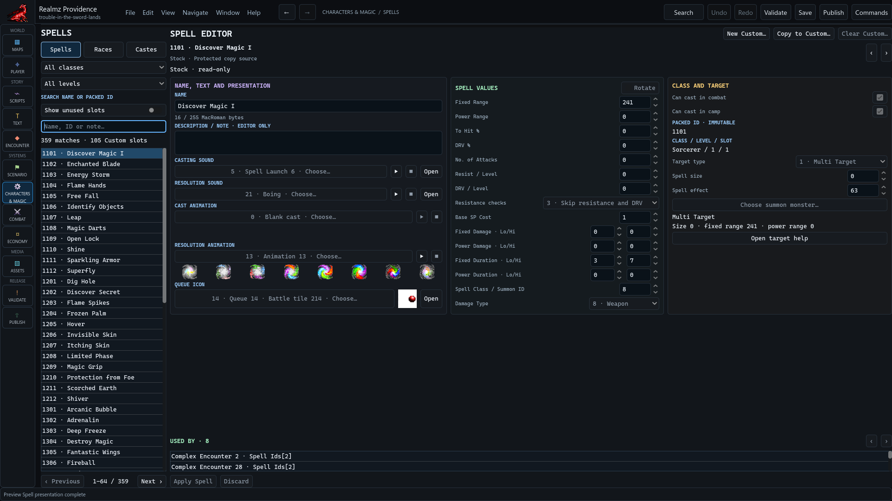 Stock copy sources, custom records, mechanics, sound and animation.</td><td><strong>Items</strong> 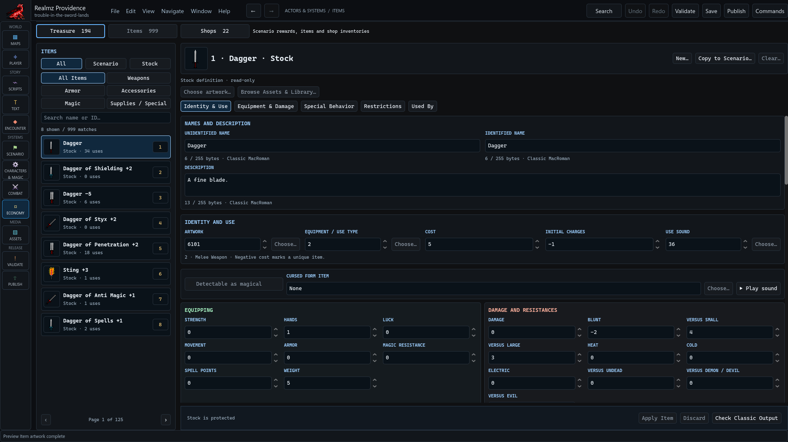 Item mechanics, restrictions, artwork and callers.</td></tr>
<tr><td><strong>Validate</strong> 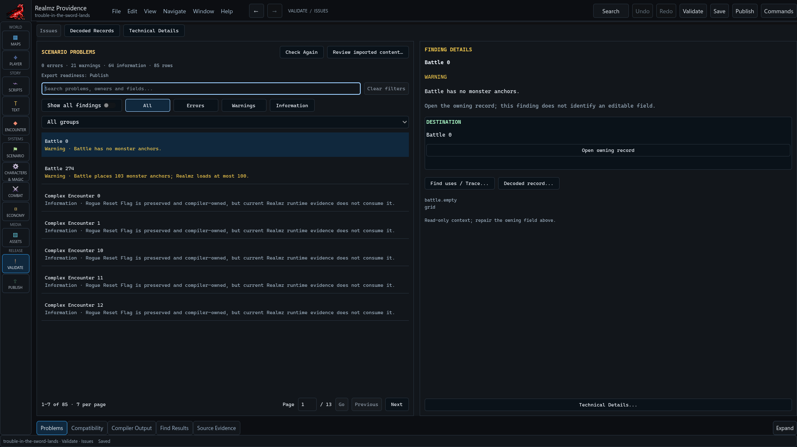 Grouped findings, affected counts and navigation to the source.</td><td><strong>Publish</strong> 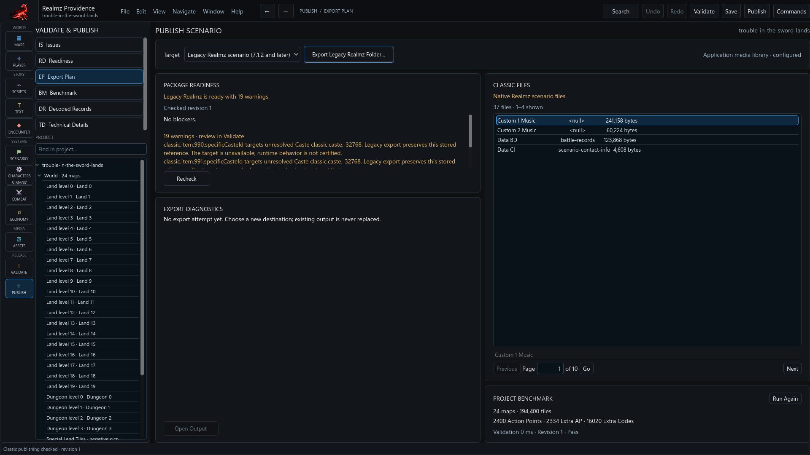 Target readiness, export planning and output selection.</td></tr>
</table>

## What you can author

### Maps and exploration

Edit Land and Dungeon levels with Paint, Bucket, Wand, stamps, selection tools,
smart terrain and the Magic Brush. Place Action Points on the map, configure
random encounter areas, edit land layouts, and manage special land artwork and
player-map records. Export map JPEGs at native size or current zoom, with optional
active overlays and a default quality of 70%.

### Scripts and narrative

Author map Action Points, reusable Extra Action Points, global hooks and quest
flags. Work with simple, complex, rogue and timed encounters, messages and text
resources. Follow typed links to their targets and callers rather than manually
hunting for record numbers.

### Combat, economy and character rules

Arrange battles and edit scenario monsters, their attacks, traits, spells,
items, rewards and difficulty variants. Drag library monsters into the scenario,
populate selections, or generate Monster/Mega variants in bulk. Edit treasure,
shops, items, spells, races and castes; stock rules remain protected copy sources.

### Media and reference material

Import and preview scenario pictures, sounds, icons, special land artwork and
supported MOD music. Scenario resources shadow the bundled stock library by
exact resource identity. The **Red Dragon** in the upper-left opens the formatted
Divinity Manual, with chapters, links, search, zoom and navigation history.

## Project workflow

1. Create a new project or inspect and import a Classic scenario folder.
2. Configure the scenario's startup and rule sources when required.
3. Edit maps, scripts, encounters, combat, rules and media.
4. Apply local drafts; use Undo/Redo for committed authoring commands.
5. Save the project. Retained original bytes remain available after reopening.
6. Validate actionable findings and review any source-derived repairs.
7. Publish a Classic folder, StuffIt archive or compiled Rebuilt package.

## Export formats and compatibility

**Classic folders** preserve the native Realmz file layout and resource forks.
**StuffIt archives** package those files and forks for transfer to Classic Mac
systems. The stored archive format has been exercised with StuffIt Expander 5.5
and a Realmz 7.1.2 scenario import/play check; that check does not certify every
scenario or every Classic reader.

**Rebuilt packages** are compiled scenario archives containing scenario-owned
content and runtime contracts. They are not editor project snapshots or a copy
of the game. Stock application support remains separate; a compatible Rebuilt
runtime enforces the package's declared execution guards.

The release gate checks known scenario imports, Save/reopen, byte-preserving
Classic exports and actual Rebuilt archive validation. Legacy authoring errors,
missing optional content and unfinished campaigns may remain diagnosed.
**Import/export success is not proof that a campaign can be completed.**

## Development

See [Building Providence](docs/public/building.md) for prerequisites, native
packaging and verification. See [Architecture and maintenance](docs/public/architecture.md)
for ownership and contribution boundaries. GitHub Actions builds Windows x64,
Linux x64 and universal macOS bundles from the same committed source.

| Directory | Responsibility |
| --- | --- |
| `crates/providence-core` | Canonical state, codecs, commands, references and compilation |
| `crates/providence-storage` | Portable snapshots, blobs and durable project operations |
| `crates/providence-native-adapter` | Native transport, jobs, filesystem and library integration |
| `crates/providence-rebuilt-package` | Package contracts and archive validation |
| `crates/providence-cli` | Headless import, inspection and compilation |
| `godot/src` | Native scenes, workbenches and interaction state |
| `godot/bundled`, `support/rebuilt` | Separately licensed stock support |
| `tools/release` | Pinned downloads, packaging and public-source checks |

## Status and licensing

**v0.6.0-beta.1** is the first native beta. Please report problems with the exact
version, scenario, tool and steps to reproduce. Include a screenshot or diagnostic
when useful; do not include private project data unless you intend to share it.

Original native Rust/Godot source is **GPL-3.0-or-later**. Realmz artwork, manuals
and support data retain **CC BY-NC-SA 4.0** and original attribution; third-party
source and the Theldrow-derived icon retain their own notices. See
[SOURCE-LICENSE.md](SOURCE-LICENSE.md), [NOTICE](NOTICE) and
[THIRD_PARTY_NOTICES.md](THIRD_PARTY_NOTICES.md).
